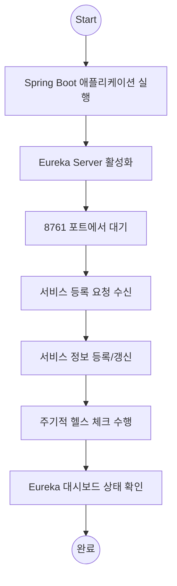

```mermaid
flowchart TD
    start((Start)) --> eurekaInit[Spring Boot 애플리케이션 실행]
    eurekaInit --> eurekaServer["Eureka Server 활성화"]
    eurekaServer --> listenPort["8761 포트에서 대기"]
    listenPort --> clientRegister[서비스 등록 요청 수신]
    clientRegister --> registryUpdate[서비스 정보 등록/갱신]
    registryUpdate --> heartbeatCheck[주기적 헬스 체크 수행]
    heartbeatCheck --> dashboard["Eureka 대시보드 상태 확인"]
    dashboard --> endNode((완료))
```